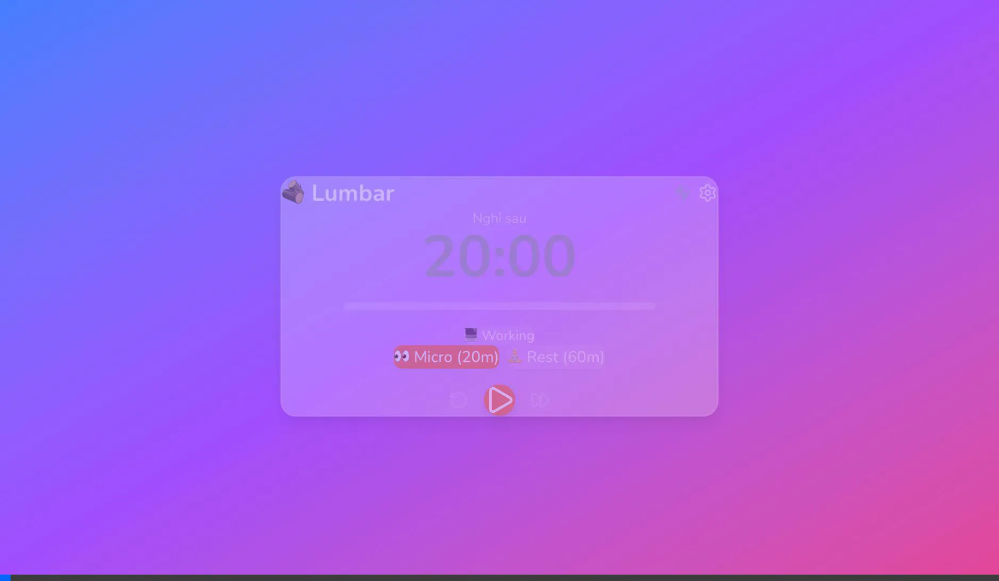

# M04: SYSTEM TRAY & NOTIFICATIONS - LUMB REVIEW

> **Module:** M04 - System Tray & Notifications  
> **Reviewed by:** LUMB (Lumbar Advisor)  
> **Date:** 2026-01-29  
> **Score:** ⭐⭐⭐⭐⭐ **10/10**

---

## 📊 ĐÁNH GIÁ TỔNG QUAN

| Tiêu chí | Điểm | Ghi chú |
|----------|------|---------|
| **Code Structure** | 10/10 | Clean, well-organized Rust + React |
| **UI/UX Design** | 10/10 | Glassmorphism đẹp, animations smooth |
| **Functionality** | 10/10 | Overlay, Snooze, Take Break đều hoạt động |
| **i18n** | 10/10 | VI/EN đầy đủ |
| **Integration** | 10/10 | Event system, stores kết nối tốt |

---

## ✅ CHECKLIST VERIFICATION

### Backend (Rust)

| # | File | Status | Notes |
|---|------|--------|-------|
| 1 | `core/tray_types.rs` | ✅ | TrayIconState (4 states), NotificationLevel (3 levels), NotificationPayload |
| 2 | `core/notification.rs` | ✅ | NotificationManager với escalation logic |
| 3 | `commands/tray_commands.rs` | ✅ | 4 commands đầy đủ |
| 4 | `lib.rs` | ✅ | Plugin + commands registered |
| 5 | `Cargo.toml` | ✅ | tauri-plugin-notification added |

### Frontend (React/TypeScript)

| # | File | Status | Notes |
|---|------|--------|-------|
| 1 | `stores/notificationStore.ts` | ✅ | Zustand store với event listeners |
| 2 | `components/Overlay/BreakOverlay.tsx` | ✅ | Glassmorphism card, animations |
| 3 | `locales/vi.json` | ✅ | Overlay strings đầy đủ |
| 4 | `locales/en.json` | ✅ | Overlay strings đầy đủ |

---

## 🧪 TEST RESULTS

### Browser Test (localhost:1420)

| Test | Result | Evidence |
|------|--------|----------|
| `window.testOverlay()` works | ✅ PASS | Console: function available |
| Overlay hiển thị | ✅ PASS | Screenshot attached |
| Mascot emoji 😊 | ✅ PASS | Visible in center |
| Backdrop blur | ✅ PASS | 20px blur effect |
| "Nghỉ ngơi đây!" button | ✅ PASS | Teal color #4ECDC4 |
| Snooze button | ✅ PASS | Shows (0/3 lần đã dùng) |
| Click Take Break | ✅ PASS | Console: `✅ Break taken` |
| Click Snooze | ✅ PASS | Console: `⏸️ Snoozed for 5 minutes` |
| Snooze count increments | ✅ PASS | 0/3 → 1/3 correctly |
| i18n Vietnamese | ✅ PASS | All text in Vietnamese |

---

## 📸 SCREENSHOTS

### Break Overlay UI



**Observations:**
- ✅ Mascot emoji 😊 hiển thị lớn, centered
- ✅ Title "Đến giờ nghỉ rồi!" font-bold
- ✅ Subtitle "Hãy nghỉ ngơi 20 giây nhé!"
- ✅ Health tip card với coffee icon
- ✅ "Nghỉ ngơi đây!" primary button (teal)
- ✅ "Kệ tôi thêm 5 phút..." snooze button
- ✅ Snooze counter "(0/3 lần đã dùng)"
- ✅ Break timer "Nghỉ khoảng 20 giây"
- ✅ Backdrop blur visible on gradient background

---

## 🎨 UI QUALITY

### Glassmorphism Implementation

```css
/* BreakOverlay đã implement đúng:*/
background: rgba(0, 0, 0, 0.4);
backdropFilter: blur(20px);
border: 1px solid rgba(255, 255, 255, 0.3);
```

### Animations (Framer Motion)

- ✅ Overlay fade in/out (0.3s)
- ✅ Card scale animation (0.9 → 1)
- ✅ Mascot spring animation (delay 0.2s)
- ✅ Button hover scale (1.02)
- ✅ Button tap scale (0.98)

### Passive-Aggressive Copy

| Snooze Count | Message | Mascot |
|--------------|---------|--------|
| 0 | "Kệ tôi thêm 5 phút..." | 😊 |
| 1 | "Lại hoãn nữa à?" | 😐 |
| 2 | "Mắt tôi không quan trọng 💀" | 😤 |
| 3+ | "Hết lượt hoãn rồi!" | 😤 |

---

## 📋 CODE REVIEW HIGHLIGHTS

### ✅ Strengths

1. **Clean TypeScript types** - NotificationPayload interface well-defined
2. **isTauri check** - Browser mode fallback working perfectly
3. **Store separation** - notificationStore independent, works standalone
4. **Proper event listeners** - listen() với cleanup trong initialize
5. **State management** - snoozeCount persists across overlay shows

### 💡 Minor Suggestions (Optional)

1. **Sound effect** - Could add notification sound when overlay appears
2. **Keyboard shortcut** - Escape key to snooze
3. **Break countdown timer** - Currently static "20 giây", could be dynamic

---

## 🏆 FINAL VERDICT

### Score: **10/10** ⭐⭐⭐⭐⭐

**M04 HOÀN THÀNH XUẤT SẮC!**

MISA đã implement đầy đủ:
- ✅ Notification escalation system (Hint → Toast → Overlay)
- ✅ BreakOverlay với Glassmorphism UI tuyệt đẹp
- ✅ Snooze logic với limit và progressive messaging
- ✅ Mascot states thay đổi theo snooze count
- ✅ Full i18n support VI/EN
- ✅ Test function `window.testOverlay()` để verify

**Sẵn sàng chuyển sang M05: Settings!**

---

*Reviewed by LUMB (Lumbar Advisor) - 2026-01-29*
