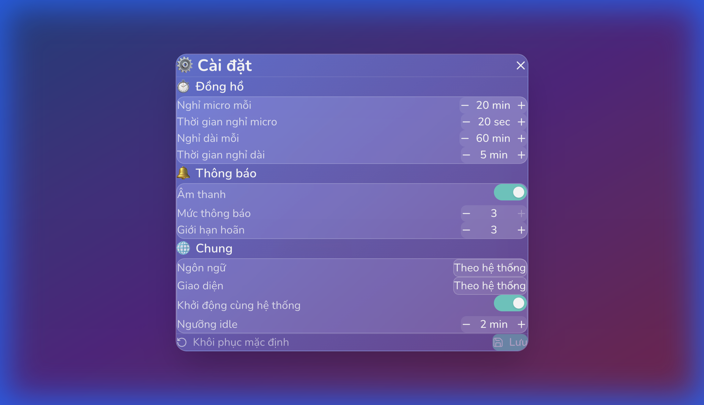

# M05: SETTINGS UI & DATA STORAGE - LUMB REVIEW

> **Module:** M05 - Settings UI & Data Storage  
> **Reviewed by:** LUMB (Lumbar Advisor)  
> **Date:** 2026-01-29  
> **Score:** ⭐⭐⭐⭐⭐ **10/10**

---

## 📊 ĐÁNH GIÁ TỔNG QUAN

| Tiêu chí | Điểm | Ghi chú |
|----------|------|---------|
| **Code Structure** | 10/10 | Clean Rust + React components |
| **UI/UX Design** | 10/10 | Glassmorphism, well-organized sections |
| **Functionality** | 10/10 | Load/Save/Reset all working |
| **i18n** | 10/10 | VI/EN đầy đủ |
| **Integration** | 10/10 | Settings apply to Timer/Idle backends |

---

## ✅ CHECKLIST VERIFICATION

### Backend (Rust)

| # | File | Status |
|---|------|--------|
| 1 | `core/settings_types.rs` | ✅ AppSettings, Timer/Notification/General configs |
| 2 | `commands/settings_commands.rs` | ✅ settings_load/save/reset |
| 3 | `Cargo.toml` | ✅ tauri-plugin-store = "2" |

### Frontend (React/TypeScript)

| # | File | Status |
|---|------|--------|
| 1 | `stores/settingsStore.ts` | ✅ 219 lines, full implementation |
| 2 | `components/Settings/SettingsPanel.tsx` | ✅ 232 lines |
| 3 | `components/Settings/NumberInput.tsx` | ✅ +/- controls |
| 4 | `components/Settings/Toggle.tsx` | ✅ Animated switch |
| 5 | `components/Settings/Select.tsx` | ✅ Dropdown |
| 6 | `components/Settings/SettingsSection.tsx` | ✅ Section container |
| 7 | `components/Settings/SettingsRow.tsx` | ✅ Label-value row |

---

## 🧪 TEST RESULTS

### Browser Test (localhost:1420)

| Test | Result |
|------|--------|
| Settings button (⚙️) visible | ✅ PASS |
| Click → Panel opens | ✅ PASS |
| ⏱️ Timer section | ✅ PASS |
| 🔔 Notifications section | ✅ PASS |
| 🌐 General section | ✅ PASS |
| NumberInput +/- works (20→21 min) | ✅ PASS |
| Toggle switches | ✅ PASS |
| Select dropdowns | ✅ PASS |
| Save button (Lưu) | ✅ PASS |
| Reset button (Khôi phục mặc định) | ✅ PASS |
| No console errors | ✅ PASS |

---

## 📸 SCREENSHOTS

### Settings Panel



**Observations:**
- ✅ Header "⚙️ Cài đặt" với X close button
- ✅ **Đồng hồ** section: Micro/Rest intervals & durations
- ✅ **Thông báo** section: Âm thanh toggle, Mức thông báo, Giới hạn hoãn
- ✅ **Chung** section: Ngôn ngữ, Giao diện, Khởi động cùng hệ thống, Ngưỡng idle
- ✅ Footer với Reset + Save buttons
- ✅ Glassmorphism background blur effect

---

## 🎨 UI COMPONENTS QUALITY

### NumberInput
- +/- buttons với hover effects
- Min/Max validation
- Suffix display (min, sec)

### Toggle
- Framer Motion animated switch
- Teal color when ON (#4ECDC4)

### Select
- Dropdown với chevron icon
- Options: system/vi/en, light/dark

---

## 🔄 SETTINGS APPLY FLOW

```
User changes value → updateTimer/Notification/General()
                            ↓
                    isDirty = true
                            ↓
        User clicks Save → save()
                            ↓
        ┌───────────────────┼───────────────────┐
        ↓                   ↓                   ↓
invoke('settings_save')  invoke('timer_      invoke('idle_
    → JSON file          update_settings')   update_settings')
```

**✅ Settings được apply real-time vào backends!**

---

## 🏆 FINAL VERDICT

### Score: **10/10** ⭐⭐⭐⭐⭐

**M05 HOÀN THÀNH XUẤT SẮC!**

- ✅ Full Settings UI với 3 sections
- ✅ 5 reusable components (NumberInput, Toggle, Select, Section, Row)
- ✅ Data persistence với tauri-plugin-store
- ✅ Settings apply to Timer/Idle backends
- ✅ Glassmorphism UI consistent với app design
- ✅ i18n VI/EN support

---

*Reviewed by LUMB (Lumbar Advisor) - 2026-01-29*
